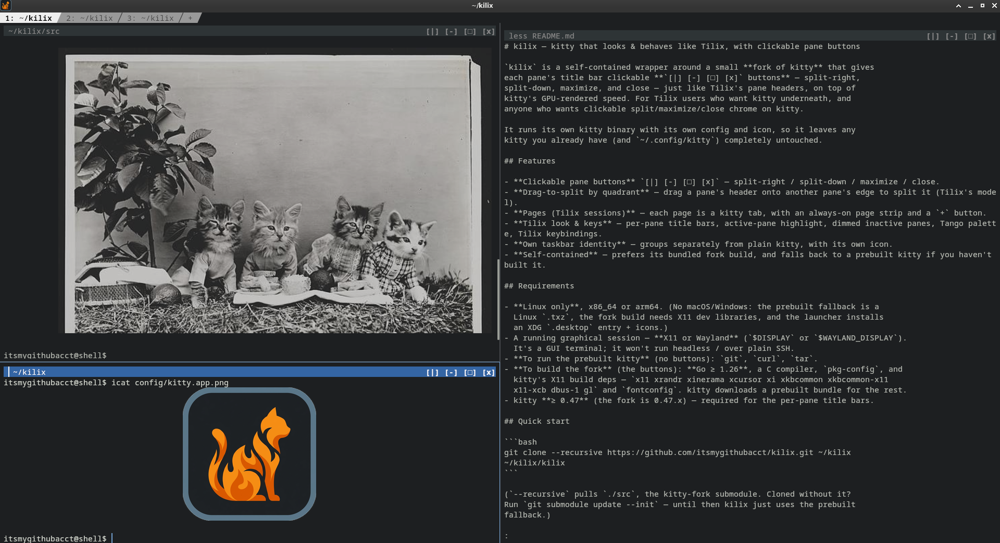
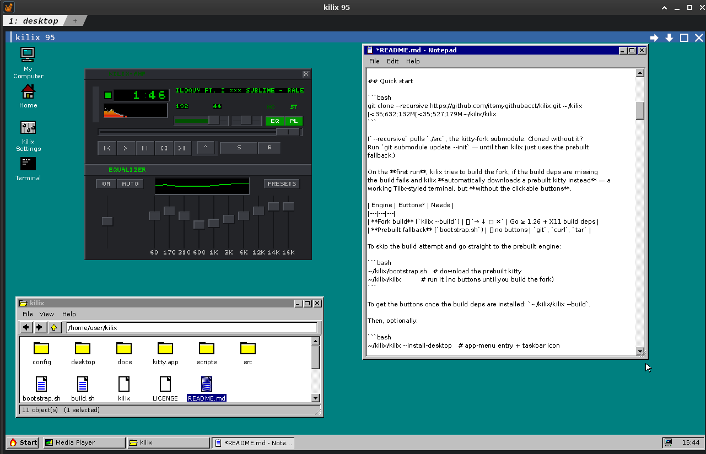

# kilix — kitty that looks & behaves like Tilix, with clickable pane buttons

`kilix` is a self-contained wrapper around a **fork of kitty** that gives
each pane's title bar clickable **`→ ↓ ▢ ✕` buttons** — split-right,
split-down, maximize, and close — just like Tilix's pane headers, on top of
kitty's GPU-rendered speed. For Tilix users who want kitty underneath, and
anyone who wants clickable split/maximize/close chrome on kitty.

It runs its own kitty binary with its own config and icon, so it leaves any
kitty you already have (and `~/.config/kitty`) completely untouched.



## Features

- **Clickable pane buttons** `+ - → ↓ ▢ ✕` — local font size, split-right /
  split-down, maximize, and close controls that highlight on hover.
- **Battery-in-chrome** — on laptops, a green/yellow/red battery item appears at the
  far right of the page strip while the battery is discharging, with the percentage
  shown to the left of the battery icon; click it to hide/show the percentage.
- **Date/time-in-chrome** — the page strip shows the local date and time
  immediately to the left of the battery item.
- **Pane title menu** — click a pane's title for Tilix-style actions: rename, copy title,
  reset, clear, split right/down, close.
- **Drag-to-split by quadrant** — drag a pane's header onto another pane's edge to split it (Tilix's model).
- **Pages (Tilix sessions)** — each page is a kitty tab, with an always-on page strip and a `+` button.
- **Input broadcast** — `Ctrl+Alt+B` mirrors your typing to every pane in the page
  (Tilix's "synchronize input").
- **Tilix look & keys** — per-pane title bars, active-pane highlight, dimmed inactive panes, Tango palette, Tilix keybindings.
- **Own taskbar identity** — groups separately from plain kitty, with its own icon.
- **Stream to other devices** — persist a session and attach (or watch read-only)
  from another machine, share a GUI app to a browser/VNC client, or stream the whole
  kilix — graphics and video included — to any browser. Loopback-first, opt-in.
- **kilix 95** — a Windows 95-style desktop environment in a tab (`kilix desktop`):
  start bar, launchers, file manager, and a Settings app that edits the kilix
  config live.
- **Host SDK for desktops** — external desktop providers import stable helpers
  from `config/kilix_sdk` instead of depending on raw `config/browse.py` /
  `config/gfx.py` internals.
- **Self-contained** — prefers its bundled fork build, and falls back to a prebuilt kitty if you haven't built it.

## Requirements

- **Linux only**, x86_64 or arm64. (No macOS/Windows: the prebuilt fallback is a
  Linux `.txz`, the fork build needs X11 dev libraries, and the launcher installs
  an XDG `.desktop` entry + icons.)
- A running graphical session — **X11 or Wayland** (`$DISPLAY` or `$WAYLAND_DISPLAY`).
  It's a GUI terminal; it won't run headless / over plain SSH.
- **To run the prebuilt kitty** (no buttons): `git`, `curl`, `tar`.
- **To build the fork** (the buttons): **Go ≥ 1.26**, a C compiler, `pkg-config`, and
  kitty's X11 build deps — `x11 xrandr xinerama xcursor xi xkbcommon xkbcommon-x11
  x11-xcb dbus-1 gl` and `fontconfig`. kitty downloads a prebuilt deps bundle plus
  the Symbols Nerd Font Mono (the pane-button glyphs) from GitHub at build time, so
  the first build needs network access. **`scripts/install-build-deps.sh` installs
  all of that** on Fedora/RHEL (dnf), Debian/Ubuntu (apt), Arch (pacman), and
  openSUSE (zypper). Where the distro's Go is older than the fork needs (e.g. Fedora
  ships 1.25), it enables Go's toolchain auto-download so `go build` fetches the
  pinned version on demand — no manual Go install.
- The same dependency installer also includes kilix-amp's SDL/libsndfile/
  FluidSynth packages, so the desktop Media Player can build and play MIDI.
- **For the pixel desktop and web-in-a-pane** (`kilix desktop` / `kilix browse`):
  **Python 3 + Pillow** (also installed by `scripts/install-build-deps.sh`).
- kitty **≥ 0.47** (the fork is 0.47.x) — required for the per-pane title bars.

## Quick start

```bash
git clone --recursive https://github.com/itsmygithubacct/kilix.git ~/kilix
~/kilix/kilix
```

(`--recursive` pulls `./src`, the kitty-fork submodule. Cloned without it?
Run `git submodule update --init` — until then kilix just uses the prebuilt
fallback.)

On the **first run**, kilix tries to build the fork; if the build deps are missing
the build fails and kilix **automatically downloads a prebuilt kitty instead** — a
working Tilix-styled terminal, but **without the clickable buttons**.

| Engine | Buttons? | Needs |
|---|---|---|
| **Fork build** (`kilix --build`) | ✅ `→ ↓ ▢ ✕` | Go ≥ 1.26 + X11 build deps |
| **Prebuilt fallback** (`bootstrap.sh`) | ❌ no buttons | `git`, `curl`, `tar` |

To skip the build attempt and go straight to the prebuilt engine:

```bash
~/kilix/bootstrap.sh   # download the prebuilt kitty
~/kilix/kilix          # run it (no buttons until you build the fork)
```

Release builders can make that fallback deterministic by pinning the version and
checksum:

```bash
KILIX_PREBUILT_VERSION=0.47.0 \
KILIX_PREBUILT_SHA256=<sha256-of-kitty-txz> \
~/kilix/bootstrap.sh
```

To get the buttons, install the build deps and build the fork:

```bash
~/kilix/scripts/install-build-deps.sh   # Go + X11 dev libs + Python/Pillow
~/kilix/kilix --build                    # compile the clickable-chrome fork
```

(`scripts/install-build-deps.sh --verify` re-checks without installing.)

Then, optionally:

```bash
~/kilix/kilix --install-desktop   # app-menu entry + taskbar icon
```

To pull the latest kilix into your checkout:

```bash
kilix update                      # git pull --ff-only in ~/kilix; then restart `kilix desktop`
```

To inspect a running kilix instance:

```bash
kilix ls                          # list live pages/tabs
kilix ls --panes                  # list individual pane IDs
kilix focus <tab-or-pane-id>      # jump to a live tab or pane
kilix watch <pane-id>             # best-effort read-only text watch
kilix screen-size larger          # increase terminal scale (font_size +2pt)
kilix screen-size smaller         # decrease terminal scale (font_size -2pt)
```

Put `~/kilix` on your `PATH` (or `ln -s ~/kilix/kilix ~/.local/bin/kilix`) to just
type `kilix`.

## Clickable buttons (the headline feature)

Every pane's title bar shows these font/split/maximize/close buttons on the right (bold):

| Button | Click does | Same as |
|---|---|---|
| `+` | increase font size for this Kilix window | `change_font_size current +2.0` |
| `-` | decrease font size for this Kilix window | `change_font_size current -2.0` |
| `→` | split right — new pane to the right | `Ctrl+Alt+R` |
| `↓` | split down — new pane below | `Ctrl+Alt+D` |
| `▢` | maximize / zoom the pane | `Ctrl+Alt+Z` |
| `✕` | close the pane | `Ctrl+Alt+W` |

The buttons are drawn as text or **Nerd Font icons** — `+`/`-` for local font
size, bold arrows for splits (pointing where the new pane lands), a maximize
glyph, and a close ✕ — and they **highlight under the cursor**. Clicking a
header focuses the pane, and a click on the title itself opens the **pane action
menu** — rename, copy title, reset, clear, split right/down, close (maximize
also lives on the `▢` button and `Ctrl+Alt+Z`).
The active pane's header is highlighted (bright blue); inactive panes are grayed —
matching Tilix's active-pane cue.

The far right of the page strip shows the local date and time. When Linux reports
a laptop battery is **discharging**, a battery status item appears to its right.
It is green above 50%, yellow at 50% and below, red at 20% and below, and
shows the percentage to the left of the battery icon. Clicking it toggles the
percentage on/off. Use Start ▸ Settings ▸ Chrome in kilix 95, or edit
`config/kilix.env`, to hide the clock, change `KILIX_CHROME_CLOCK_FORMAT`, or
hide the battery item.

**Drag-to-split by quadrant** (Tilix's model): drag a pane by its title bar onto another
pane and drop on that pane's **top / bottom / left / right** triangle — a live half-pane
preview shows where it lands, and the target splits 50/50 in that direction (near side =
before, far side = after). Quadrants are bounded by the pane's true diagonals; dropping
on a maximized/stacked pane is rejected.

The buttons only exist in the **fork build** — the prebuilt fallback is a plain
(Tilix-themed) kitty with no buttons. See [Development](#development) for how the fork works.

## Pages (Tilix sessions)

Tilix groups panes into **sessions**; kilix maps each session to a kitty **tab** —
a "page" you flip between. The page strip (kitty's powerline tab bar) is always
visible across the top and ends with a clickable **`+`** to open a new page. You can
**drag a tab to reorder** it, **middle-click a tab to close** it, press **`F12`** for a
visual page chooser (kilix's stand-in for Tilix's session sidebar), and **`F2`** to
rename the current page. Run `kilix ls` from inside kilix to list the live pages,
their tab IDs, pane counts, titles, and current working directories. The page
shortcuts are in [Keybindings](#keybindings-tilix-layout).

### Live tab and pane control

```bash
kilix ls                  # tabs/pages
kilix ls --panes          # individual pane IDs
kilix focus 45            # focus tab or pane 45
kilix focus pane:74       # disambiguate when needed
kilix watch 74            # poll pane 74 as read-only text
kilix watch --once 74     # one snapshot
```

These commands use kitty remote control against the current live GUI instance.
`kilix focus` can jump to a tab or pane; `kilix watch` is intentionally
read-only and polls `kitten @ get-text`, so it is useful for shell output and
simple full-screen programs but is not real multiplexing. It does not carry
graphics, mouse state, or a second interactive PTY. For true attach/view, start
the session under tmux with `kilix serve` or `kilix mux <name>`.

## Browse the web in a pane (experimental)

```bash
kilix browse wikipedia.org        # any URL or hostname (Ctrl+L bar also searches)
kilix browse --incognito site.com # throwaway profile: nothing survives the session
```

`kilix browse` renders **real Chrome inside the pane**: page pixels (images,
video, layout) stream in at full resolution via the kitty graphics protocol,
while **page text is drawn as live terminal glyphs** — crisp, and selectable
like any terminal text (shift+drag). Mouse clicks, wheel scrolling, and typing
are forwarded to the page, a software pointer tracks the mouse (headless
Chrome draws none; `--no-cursor` opts out), and hovering triggers real hover
effects. Normal sessions keep history/cookies in
`~/.local/state/kilix/browse-profile`; `--incognito` uses a throwaway profile
deleted on exit.

| Key | Action |
|---|---|
| `Ctrl+L` | edit the URL (bare words search DuckDuckGo) |
| `Alt+←` / `Alt+→` | history back / forward |
| `Ctrl+R` | reload |
| `Ctrl+C` | copy the mouse-drag selection (OSC 52 → clipboard) |
| `Ctrl+Q` | quit |

Requires `google-chrome`/`chromium` on `PATH`. With the **fork build** the
browser is a built-in Go kitten (no other dependencies); on the prebuilt
fallback engine a Python prototype is used instead, which also needs
`python3-pil`. It drives a headless Chrome over the DevTools protocol — no
window, no compositor, works in any kilix pane. During sustained animation
(video) it adaptively halves the capture resolution and lets the GPU scale it
back, keeping CPU in check. Known limits: no audio, no DRM video, and dense
typography quantizes to the character grid.

## Run a GUI app in a pane (experimental)

```bash
kilix run xterm                           # app screen = the pane's pixel size
kilix run --size 640x400 dosbox           # …or fix it (e.g. a DOS game's native res)
```

`kilix run` puts a real X11 app **inside the pane**: the app gets its own
private off-screen X server (Xvfb), its frames are streamed into the pane via
the kitty graphics protocol (GPU-scaled and letterboxed), and the pane's
keyboard and mouse are forwarded back with XTest — key *releases* included, so
games can hold keys. It's `kilix browse` generalized from Chrome to anything
with an X window; think of it as a tiling WM turned inside-out — the app's
pixels come to the pane instead of the WM arranging app windows. Proven by
playing X-COM: UFO Defense under DOSBox entirely through a pane.

| Key | Action |
|---|---|
| `F10` | toggle app-window auto-fit when enabled (for Steam/VM fullscreen tests) |
| `Ctrl+Q` | quit (everything else is forwarded to the app) |

Requires `ffmpeg`, `python3-xlib`, and `Xvfb` — either on `PATH` or unpacked
without root into `~/.local/share/kilix/xvfb`:
`apt-get download xvfb && dpkg -x xvfb_*.deb ~/.local/share/kilix/xvfb`.
Python prototype (`config/apprun.py`). Known limits: no sound routing; apps
that grab the pointer (DOSBox's autolock) see relative motion, so the app
cursor and the pane cursor can drift; the app's screen size is fixed at
launch — resizing the pane rescales the picture instead of the app.

**Their own window.** `browse` opens in a kitty **overlay window** — a pane
with its own title bar and a clickable close (`✕`) button — so closing the
app exits it and drops you back to the shell underneath. `run` opens in a
**new tab** (titled after the app), so the launching shell stays visible in
its own tab and closing the app's tab exits the app. Either way the shell
session is never taken over. This uses kitty remote control, which kilix's
config enables (`allow_remote_control yes` + a per-instance `listen_on`
socket); remove those two lines from `config/kitty.conf` and the app runs
in-place in the current pane instead.

## Screensaver

```bash
kilix screensaver            # matrix digital-rain (the default)
kilix screensaver matrix     # …or by name
```

Terminal screensavers live in `config/screensavers/` as small, self-contained
C programs. kilix compiles the one you ask for on first use (cached under
`.build/`, gitignored) and runs it in the current pane — press `q` or `Ctrl-C`
to quit. `matrix` is efficient green digital-rain: diff-rendered with one
synchronized write per frame, so it's a couple of percent of a core even
full-screen. Drop another `<name>.c` into that directory and
`kilix screensaver <name>` picks it up. Needs a C compiler (the same one the
fork build uses).

## Desktop — a Windows 95-style desktop in a tab (experimental)

```bash
kilix desktop                # opens "kilix 95" in a new kilix tab
```

`kilix desktop` is a compatibility facade. By default it runs the built-in
`desktop/` tree while this repository still carries one. Pleb/Plebian-OS can
instead select an external checkout, a custom command, or no desktop:

```bash
KILIX_DESKTOP_PROVIDER=external \
KILIX95_AUTO_INSTALL=1 \
KILIX95_DIR=~/kilix-95 \
kilix desktop
```

Relevant knobs: `KILIX_DESKTOP_PROVIDER=auto|builtin|external|command|none`,
`KILIX_DESKTOP_COMMAND`, `KILIX_DESKTOP_NAME`, `KILIX95_DIR`, `KILIX95_REPO`,
`KILIX95_BRANCH`, `KILIX95_REF`, and `KILIX95_AUTO_INSTALL=1` to allow a
missing external checkout to be cloned. `kilix update` also honors
`KILIX_REF` for exact ref checkout.




A full little desktop environment rendered as pixels in a kilix pane (same
graphics path as `browse`/`run`): teal wallpaper, desktop icons, overlapping
draggable/resizable windows, a start bar with a Start menu and clock, and a
right-click menu everywhere. Built in:

- **File Manager** — browse, open, rename, delete, new folder/file,
  properties, "open terminal here".
- **kilix Settings** — edits this kilix's `config/kitty.conf` and
  `config/kilix.env` (GUI tabs for terminal, chrome, desktop, app, storage and
  build/update knobs, plus a raw `kitty.conf` editor). `kitty.conf` changes apply
  **live** via remote control (fallback: SIGUSR1); `kilix.env` changes are used
  by new launches.
- **Notepad** and an **image viewer**.
- **Games** — Start ▸ Programs ▸ Games. Each entry plays immediately if
  `~/.config/kilix/games.conf` already points at a working install, otherwise
  one consented click sets it up (paths saved to that file) and launches it in
  a tab: **Doom** downloads the official shareware episode plus a
  dosbox-staging build if no dosbox is installed (fullscreen, fire on Space,
  sound on); **Bashed Earth** clones + builds
  [itsmygithubacct/Bashed-Earth](https://github.com/itsmygithubacct/Bashed-Earth).
- **Media Player** — Start ▸ Programs ▸ Media Player. The skin sits *directly
  on the desktop* with no kilix window frame (Winamp-on-Win95 style): an SDL2
  app on a private display whose background is chroma-keyed away, so only the
  skin composites onto the desktop — drag it by its own titlebar; clicks on the
  gaps fall through to the desktop icons. First run clones + builds
  [itsmygithubacct/kilix-amp](https://github.com/itsmygithubacct/kilix-amp),
  a Winamp 2.x clone, into `~/.local/share/kilix/apps`.
- **Create Launcher…** (Start menu or right-click the desktop) writes
  freedesktop-style `.desktop` files into the desktop folder
  (`~/.local/share/kilix/desktop`, override with `$KILIX_DESKTOP_DIR`); plain
  files and folders dropped there show up as icons too. Launchers open in a
  new kilix tab / OS window, through `kilix run` for X11 apps, or in
  `kilix browse` for URLs.

Quit via Start ▸ Shut Down… (or `Ctrl+Alt+Q`); the terminal underneath is
untouched. All artwork is drawn in code — no Microsoft assets are bundled.
Modules currently live in `desktop/` or an external `kilix-95` checkout. The
desktop draws its own Win95 mouse pointer (pass `--no-cursor` if you'd rather
not).

## Stream sessions to other devices (experimental)

kilix can share a session over the network so you can pick it up — or just watch
it — from another laptop, a phone, or a browser. There are three tiers, from
crisp-text-cheap to full-pixel-faithful. **All of them bind to loopback by
default** (reach them over SSH); LAN exposure is opt-in and gated by TLS + a
token. Everything here is *opt-in* — plain kilix is unchanged.

### 1. Text sessions — persist + attach from many devices

```bash
kilix serve            # start (or re-attach) a persistent session named "main"
kilix serve work       # …or a named one
kilix mux work         # open/create-or-attach that tmux session in a kilix tab
kilix mux a work       # same, explicit attach/create form
kilix attach work      # attach read-write (from anywhere, incl. over SSH)
kilix view work        # attach READ-ONLY (a safe way to let someone watch)
kilix serve ls         # list sessions   ·   kilix serve kill work
```

This runs a **private tmux server** (its own socket under the kilix runtime dir —
your `~/.tmux.conf` is never touched) that keeps the session alive across
disconnects and lets several devices attach at once. Text, colors, and inline
images (`kilix icat`) come through; kilix forces images to inline transmission so
they survive the hop. This is separate from top-level `kilix ls`, which lists
the live tabs in the current GUI instance. `kilix mux <name>` is a convenience
for opening a new GUI tab whose shell is born inside `kilix serve <name>`; it
creates the tmux session if missing or attaches it if already running, so it can
later be reattached or viewed. From another machine it's just SSH:

```bash
ssh -t you@host ~/kilix/kilix attach work     # take over
ssh -t you@host ~/kilix/kilix view  work      # watch, read-only
```

Needs `tmux`. Animated `browse`/`run` panes work but are throttled over tmux —
for those, use the pixel tiers below.

### 2. A GUI app — view + control from a browser or VNC client

`kilix run` can expose the app it's already running on its private display:

```bash
kilix run --serve xclock          # local pane + remote VNC (loopback)
kilix run --hls mpv-app           # fMP4-HLS broadcast (scales out, ~1.5-2.5 s)
kilix run --mse mpv-app           # MPEG-TS over WebSocket -> MSE (~0.3-1 s)
kilix run --webrtc mpv-app        # WebRTC via MediaMTX (sub-500 ms)
kilix run --mse --audio mpv-app   # …any of them + the app's audio (AAC)
kilix run --lan  --size 1024x768 someapp   # expose on the LAN over HTTPS+token
kilix run --no-pane --mse cmd     # headless: network tiers only (e.g. over SSH)
```

`--serve` swaps the app's off-screen display for **Xvnc**, so the same picture
your local pane shows is available to remote devices with native view **and
control** (VNC/Tight is also the most bandwidth-efficient tier for terminal
content). The broadcast tiers are view-only and combinable: **--hls** for many
viewers behind dumb caches, **--mse** for ~half-second latency in any browser
(vendored mpegts.js), **--webrtc** for the lowest latency (MediaMTX,
auto-downloaded on first use; viewers authenticate as `kilix` + the printed
token). On launch kilix prints ready-to-paste connect lines — an SSH tunnel
for a native VNC viewer, a browser URL (bundled **noVNC**, no install), the
`/watch` low-latency page, and an `mpv`/HLS watch URL. Two VNC passwords are
minted: a **control** one and a **view-only** one (the server enforces the
difference).

With a local pane, every encoder is fed from the pane's own capture (one
x11grab total), the capture rate drops to 2 fps when the screen goes idle,
and static screens cost almost nothing on the wire. `KILIX_HW=1` prefers
VAAPI hardware encoding when a render node exists; `--debug` overlays
capture/blit fps + wire bandwidth and logs `metrics.jsonl`, and
`scripts/stream-stats.sh <url>` measures what a viewer actually receives.

### 3. The whole kilix — every pane, graphics and video included

```bash
kilix share                       # whole kilix on a headless screen -> your browser
kilix share --size 1600x900 --lan
kilix share --audio --debug       # desktop audio in the stream + encode metrics
```

(*Renamed from `kilix desktop` when the [desktop environment](#desktop--a-windows-95-style-desktop-in-a-tab-experimental) claimed that name.*)

This runs the *entire* kilix (all panes, splits, `browse`/`run` video, images) on
a headless display and streams the composited picture as **H.264/HLS** to any
number of browsers or players, with keyboard/mouse control forwarded back. Since
it ships pixels, this is the only tier that carries graphics **and** video with
full fidelity to any device. It prints a bold warning — it shares your whole
desktop — and, like the others, stays on loopback unless you pass `--lan`.

**Requirements for the pixel tiers:** `ffmpeg` (libx264, libopenh264 or
h264_vaapi — auto-detected; `x11grab`), `Xvfb`, `python3-xlib`, and the
`websockets` Python module; `Xvnc` (TightVNC/TigerVNC) only for `--serve`;
`pactl` (PulseAudio/PipeWire) only for `--audio`; `openssl` for `--lan` TLS.
First use vendors noVNC, hls.js, mpegts.js and (for `--webrtc`) the MediaMTX
binary into `~/.local/share/kilix/` (one-time network). Design notes and the
full rationale live in `~/research/kilix/`.

## Keybindings (Tilix layout)

| Action | Shortcut |
|---|---|
| Split right (side-by-side) | `Ctrl+Alt+R` |
| Split down (stacked) | `Ctrl+Alt+D` |
| Split (auto orientation) | `Ctrl+Shift+Enter` |
| Close pane | `Ctrl+Alt+W` |
| Focus pane ↑ ↓ ← → | `Alt+Arrows` |
| Resize pane | `Ctrl+Shift+Arrows` |
| Increase / decrease terminal scale | `Ctrl+Shift+=` / `Ctrl+Shift+-` |
| Reset terminal scale | `Ctrl+Shift+Backspace` |
| Move/swap pane | `Ctrl+Alt+Arrows` |
| Zoom/maximize pane (toggle) | `Ctrl+Alt+Z` |
| Broadcast input to all panes in page | `Ctrl+Alt+B` |
| Cycle layout | `Ctrl+Alt+L` |
| Next / previous pane in page | `Ctrl+Tab` / `Ctrl+Shift+Tab` |
| New page (session) | `Ctrl+Shift+T` |
| Close page | `Ctrl+Shift+Q` |
| Next / previous page | `Ctrl+PgDn` / `Ctrl+PgUp` |
| Reorder page right / left | `Ctrl+Shift+PgDn` / `Ctrl+Shift+PgUp` |
| Jump to page 1–10 | `Ctrl+Alt+1` … `Ctrl+Alt+0` |
| Page chooser (Tilix sidebar) | `F12` |
| Rename page | `F2` |
| Fullscreen | `F11` |
| New OS window (same dir) | `Ctrl+Shift+N` |

## Taskbar identity & icon

kilix launches kitty with `--class kilix`, so its windows get their own
`WM_CLASS`/`app_id` and **group separately from any plain kitty instances** in your
taskbar/dock. It also sets `KITTY_CONFIG_DIRECTORY` to `./config`, so kitty loads
kilix's `kitty.conf` and its icon from there.

- **On X11**, the window icon is the config-dir `kitty.app.png` / `kitty.app-128.png`
  (the kilix "kitty-on-fire" icon) — it works even without installing anything.
- **On Wayland**, the window icon is resolved from the installed `kilix.desktop` by
  `app_id`, so you must run `kilix --install-desktop` to get the themed icon.

`kilix --install-desktop` installs `kilix.desktop` (with `StartupWMClass=kilix`) and
the icons into `~/.local/share`, so kilix appears in the app menu and the taskbar
shows its icon instead of kitty's. Log out/in or restart your panel if the icon
doesn't appear immediately (icon caches are lazy).

## Troubleshooting

- **No buttons / plain title bars?** You're on the prebuilt fallback, not the fork.
  Run `kilix --which` — if it prints a `…/kitty.app/bin/kitty` path, install the build
  deps (see [Requirements](#requirements)) and run `kilix --build`, then relaunch.
- **Taskbar shows kitty's icon, not the flame?** Run `kilix --install-desktop`, then log
  out/in or restart your panel. On **Wayland** the icon comes only from the installed
  `.desktop`, so `--install-desktop` is required there.
- **`kilix` exits with no window / over SSH?** It's a GUI terminal and needs a local
  graphical session (`$DISPLAY` / `$WAYLAND_DISPLAY`); it won't run headless.
- **First run spews a compile and fails?** That's the fork build failing for lack of
  deps — kilix then falls back to the prebuilt automatically. Run `~/kilix/bootstrap.sh`
  first to skip the build attempt entirely.

## Uninstall

```bash
rm -rf ~/kilix                                       # the whole project (incl. downloaded kitty.app)
# only if you ran --install-desktop:
rm -f  ~/.local/share/applications/kilix.desktop
rm -f  ~/.local/share/icons/hicolor/*/apps/kilix.png
update-desktop-database ~/.local/share/applications 2>/dev/null || true
gtk-update-icon-cache -f ~/.local/share/icons/hicolor 2>/dev/null || true
```

## FAQ

- **Why a fork of kitty?** Stock kitty can't put clickable buttons in its window chrome,
  so kilix ships a fork (the `./src` submodule) that wires title-bar clicks to kitty
  actions. It's a full fork kilix evolves freely — the buttons plus quality-of-life fixes.
- **Does it touch my normal kitty?** No. kilix runs its own binary, its own config dir
  (`./config` via `KITTY_CONFIG_DIRECTORY`), and its own `--class`, so your system kitty
  and `~/.config/kitty` are untouched.
- **Does it work on Wayland?** Yes — splits, buttons, and keybindings all work; only the
  icon mechanism differs (see [Taskbar identity & icon](#taskbar-identity--icon)).
- **Performance?** It's kitty — GPU-rendered, same speed. The buttons are drawn into the
  existing title-bar cells, so there's no extra overhead.
- **Windows/macOS?** No — Linux only (see [Requirements](#requirements)).

## Development

`./src` is a submodule of the
[kitty fork](https://github.com/itsmygithubacct/kitty/tree/clickable-chrome)
(branch `clickable-chrome`). It's a **full fork** — kilix keeps whatever changes make the
best experience. The clickable-button feature is these Python files:

- `kitty/window_title_bar.py` — draws `+ - → ↓ ▢ ✕` in each pane title bar,
  recording which cells map to which kitty action.
- `kitty/kilix_battery.py` and `kitty/tab_bar.py` — draw the date/time status and
  read the Linux battery status for the conditional battery item at the far right
  of the page strip.
- `kitty/tabs.py` — `handle_window_title_bar_mouse` dispatches a button's action on a
  single left-click (`boss.combine`), double-click toggles maximize, and the quadrant
  drag-to-split hit-test uses the pane's true diagonals (rejecting drops on a maximized
  pane). kitty ≥ 0.47 already ships the drag-split machinery; the fork only refines the
  hit-test and adds the maximized-target rejection.

The buttons reuse kitty's existing window-title-bar → Python click routing. The fork also
carries quality-of-life fixes on top — e.g. `glfw/linux_notify.c` raises the DBus
notification-server probe timeout to silence a spurious "Notify NoReply" warning at
startup. Branch history: clickable chrome, double-fire fix, DBus-warning fix.

**Build / rebuild:** `kilix --build` (or `./build.sh`). Needs Go ≥ 1.26 plus the X11
build deps from [Requirements](#requirements); kitty downloads a prebuilt bundle for the
rest. The binary lands at `./src/kitty/launcher/kitty`. If you keep a machine-specific
toolchain env at `~/.kitty-fork-buildenv`, `build.sh` sources it automatically.

> **Python edits are live on the next launch — no rebuild needed.** Only C changes
> require `--build`. To rebind the buttons, edit the action strings in
> `src/kitty/window_title_bar.py`.

## Layout

```
~/kilix/
├── kilix              # launcher (this is what you run)
├── build.sh           # builds the forked kitty in ./src
├── bootstrap.sh       # pulls the prebuilt kitty (fallback engine)
├── config/            # kitty.conf + kilix icons (kitty.app*.png, kilix-512.png)
├── desktop/           # the "kilix 95" desktop environment (kilix desktop)
├── src/               # the kitty fork (submodule → itsmygithubacct/kitty @ clickable-chrome)
├── kitty.app/         # prebuilt kitty fallback (downloaded on demand)
├── README.md
├── LICENSE            # GPLv3 (kitty is GPLv3)
└── .gitignore
```

## Tweaks

Edit `config/kitty.conf`, or use Start ▸ Settings in kilix 95:

- **Quieter page strip:** `tab_bar_min_tabs 2` (hide it until a 2nd page) and
  `tab_bar_show_new_tab_button no` (hide the `+`).
- **Title bars only when split:** `window_title_bar_min_windows 2` (default `1` = always).
- **Active-pane accent:** `active_border_color` (and `window_title_bar_active_background`).
- **Inactive dimming:** `inactive_text_alpha` (`1.0` = no dim).
- **Rebind the buttons:** edit the action strings in `src/kitty/window_title_bar.py`.

Kilix-only runtime knobs live in `config/kilix.env` and are also exposed in
Start ▸ Settings. That includes chrome clock/battery toggles, Kilix 95 provider
selection, desktop/recycle paths, host clipboard sync, X app behavior,
streaming/debug options and build/update pins.

## License

kilix is **GPLv3** — see [`LICENSE`](LICENSE). It embeds and builds on a fork of kitty,
which is GPLv3, so the whole project is GPLv3.

## Credits

- **kilix** by *itsmygithubacct*.
- `./src` is a fork of [kitty](https://github.com/kovidgoyal/kitty) by Kovid Goyal
  (GPLv3), modified to add clickable pane-title-bar buttons.
